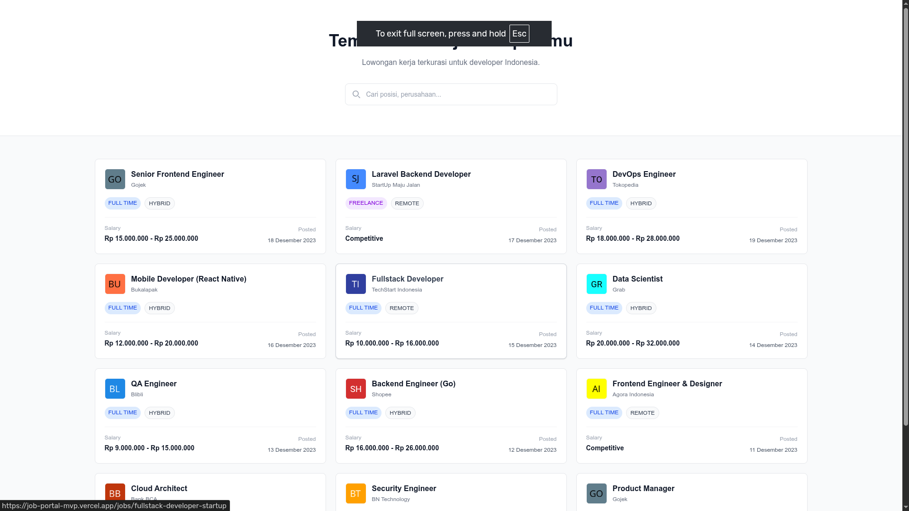

<div align="center">
  
  
  # 🚀 Job Portal MVP
  
  <p>A modern, fast, and responsive job portal built with Next.js 15 and TypeScript</p>

  [](https://nextjs.org/)
  [](https://www.typescriptlang.org/)
  [](LICENSE)

</div>

---

## ✨ Features

- 🔍 **Advanced Job Search** - Real-time search with debouncing
- 💼 **Job Listings** - Browse and filter job opportunities
- 📱 **Responsive Design** - Works seamlessly on all devices
- ⚡ **Optimized Performance** - Built with Next.js App Router
- 🎨 **Modern UI** - Clean and intuitive user interface
- 🔗 **SEO Optimized** - Dynamic metadata for better discoverability

## 🛠️ Tech Stack

- **Framework:** [Next.js 16](https://nextjs.org/) (App Router)
- **Language:** [TypeScript](https://www.typescriptlang.org/)
- **Styling:** [Tailwind CSS](https://tailwindcss.com/)
- **Package Manager:** [pnpm](https://pnpm.io/)

## 📁 Project Structure

```
job-portal-mvp/
├── app/                  # Next.js App Router
│   ├── jobs/            # Job listings and details
│   ├── layout.tsx       # Root layout
│   └── page.tsx         # Home page
├── components/          # Reusable React components
├── hooks/               # Custom React hooks
├── lib/                 # Utility libraries and data
├── types/               # TypeScript type definitions
├── utils/               # Helper functions
└── public/              # Static assets
```

## 🚀 Getting Started

### Prerequisites

- Node.js 22+ 
- pnpm (recommended) or npm/yarn/bun

### Installation

1. Clone the repository
```bash
git clone https://github.com/ersyncd/job-portal-mvp.git
cd job-portal-mvp
```

2. Install dependencies
```bash
pnpm install
```

3. Run the development server
```bash
pnpm dev
```

4. Open [http://localhost:3000](http://localhost:3000) in your browser

### Available Scripts

```bash
pnpm dev          # Start development server
pnpm build        # Build for production
pnpm start        # Start production server
pnpm lint         # Run ESLint
```

## 🎯 Roadmap

- [ ] User authentication
- [ ] Job application system
- [ ] Employer dashboard
- [ ] Advanced filtering
- [ ] Saved jobs functionality
- [ ] Email notifications

## 📚 Learn More

- [Next.js Documentation](https://nextjs.org/docs) - Learn about Next.js features and API
- [Next.js Tutorial](https://nextjs.org/learn) - Interactive Next.js tutorial
- [TypeScript Handbook](https://www.typescriptlang.org/docs/) - TypeScript documentation

## 📄 License

This project is licensed under the MIT License.

## 🤝 Contributing

Contributions, issues, and feature requests are welcome!

---

<div align="center">
  Made with ❤️ using Next.js
</div>
